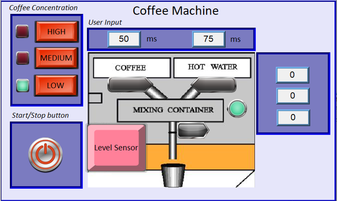

# Coffee Machine Automation Project

## Project Overview
The **Coffee Machine Automation Project** aims to automate the brewing process of a coffee machine by using a **Programmable Logic Controller (PLC)** and a **Human-Machine Interface (HMI)**. The project integrates various components like PLC logic, sensor feedback, timer control, and real-time user interface to create a seamless automation system for controlling the coffee machine. This system allows the user to select the coffee concentration (Low, Medium, High), and the machine automatically adjusts the volume of coffee and water dispensed based on the selection.

The project also features **real-time process monitoring** through the HMI and uses a **liquid level sensor** to stop the valve once the cup reaches a low level. This automation eliminates manual control, ensuring consistency and efficiency in the coffee brewing process.

### HMI Interface
The **HMI** plays a crucial role in this project, enabling users to interact with the system. Here's a preview of the HMI interface that lets users select the coffee concentration and monitor the brewing process:

## Key Features
- **User-Controlled Concentration Selection**: Allows users to choose between Low, Medium, or High coffee concentration via the HMI interface.
- **Dynamic Timer Control**: Automatically adjusts the dispensing of coffee and water based on the concentration level selected.
- **Mixing Process**: The coffee and water are mixed before being dispensed into the cup, ensuring uniformity.
- **Real-Time Monitoring**: The HMI displays the status of the brewing process, including time remaining and concentration level.
- **Automatic Valve Control**: The valve opens to fill the cup, and the system automatically stops when the liquid level sensor detects a low cup level.
- **System Feedback and Alerts**: The HMI provides real-time feedback on the system’s status and any alerts for maintenance or error handling.

## Technologies and Tools Used
- **PLC Programming**: Developed using **ISPSoft** for controlling the coffee machine's logic and automation process.
- **HMI Interface**: Created with **EasyBuilder**, enabling the user to interact with the system by selecting coffee concentration and monitoring the process.
- **Timer Logic**: Configured to control the amount of coffee and water dispensed based on the selected concentration level.
- **Liquid Level Sensor**: Integrated with the PLC to stop the valve once the desired cup level is reached.
- **Real-Time Monitoring**: The HMI displays real-time data on the brewing status, enabling users to track the process.

## System Workflow
1. **User Interaction**: The user selects the desired coffee concentration (Low, Medium, or High) from the HMI.
2. **PLC Logic Execution**: Based on the selected concentration, the PLC calculates and triggers the appropriate timers for dispensing coffee and water.
3. **Mixing**: The coffee and water are dispensed and mixed before filling the cup.
4. **Cup Filling**: The valve opens to fill the cup, and once the sensor detects that the cup is nearly empty, the valve closes automatically.
5. **Real-Time Display**: The HMI displays real-time feedback throughout the entire process, including the status of timers and liquid levels.

## Design Considerations
This project was designed to provide a balance between **automation** and **user interaction**. The integration of the **HMI** ensures that users can easily select the desired coffee concentration and track the brewing process, while the **PLC logic** ensures that the entire process operates smoothly with minimal human intervention.

The **liquid level sensor** is a critical component of the system, ensuring that the brewing process is automatically stopped when the cup is full, preventing overflow and waste. The use of **timers** allows the system to be flexible and scalable, making it adaptable to various coffee machine designs and configurations.

## Setup and Usage Instructions
1. **Setup PLC**: Open the `.isp` file in **ISPSoft** and upload the PLC logic to the PLC controller.
2. **Configure HMI**: Use **EasyBuilder** to configure and upload the HMI interface, which allows the user to interact with the system and select the coffee concentration.
3. **System Integration**: Connect the PLC to the coffee machine, the liquid level sensor, and the valve. Ensure the sensors and actuators are correctly wired for proper operation.
4. **Run the System**: After setting up the system, use the HMI to select the coffee concentration and start the brewing process. Monitor the real-time process on the HMI interface.

## Future Enhancements
- **Automated Maintenance Alerts**: Integrate sensor feedback to notify users when the system requires maintenance (e.g., when filters need replacement).
- **Data Logging**: Implement data logging for tracking coffee brewing statistics and performance over time.
- **Remote Control**: Add the ability to control and monitor the system remotely via a mobile app or web interface.

## License
This project is licensed under the MIT License.
